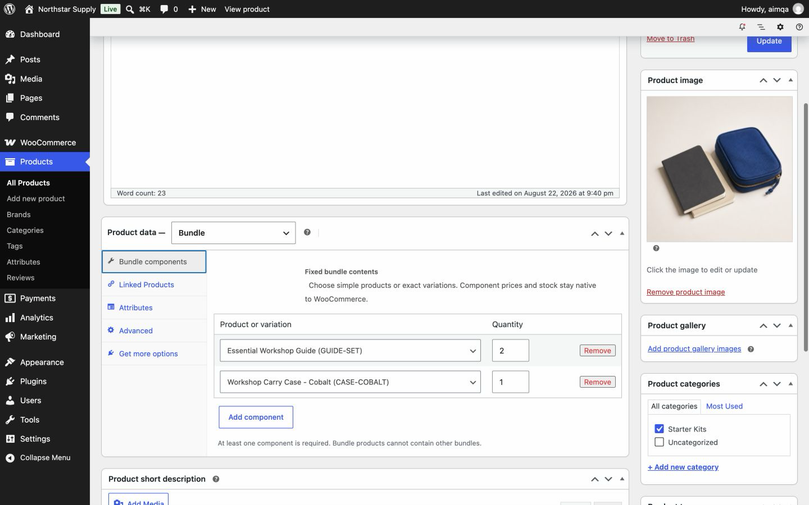
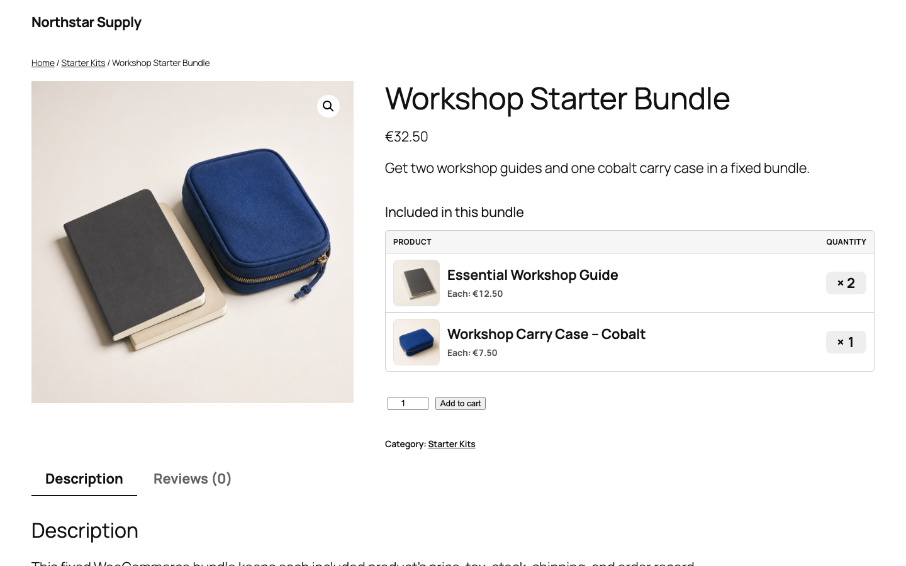
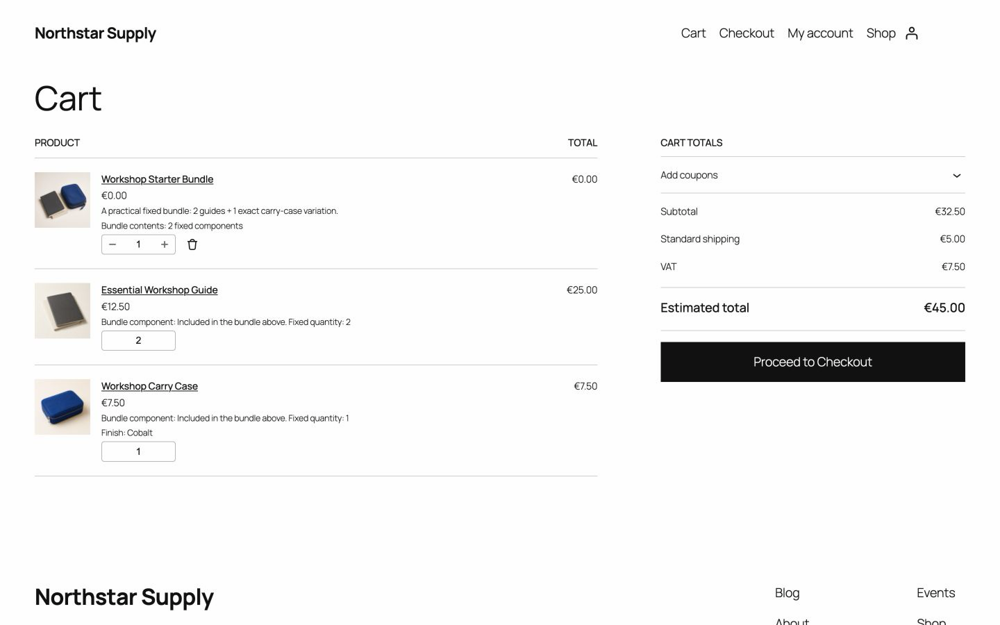
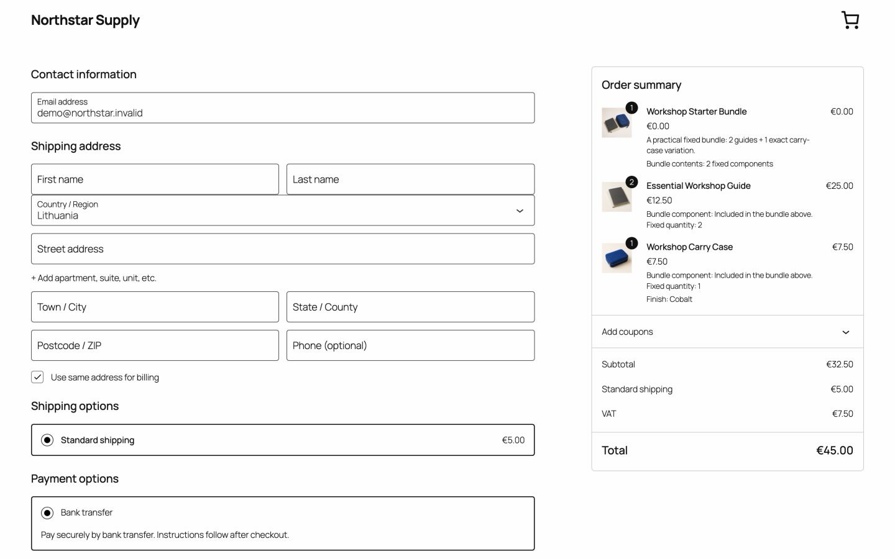

# Advanced Bundles for WooCommerce

[](https://github.com/we-wp/advanced-bundles-for-woocommerce/releases/latest)
[](https://github.com/we-wp/advanced-bundles-for-woocommerce/actions/workflows/quality.yml)
[](LICENSE)

Advanced Bundles is a free, open-source WooCommerce plugin for fixed product bundles. Choose simple products or exact variations, set quantities, and sell them as one bundle while WooCommerce keeps control of pricing, stock, tax, shipping, orders, and refunds.

[**Download Free 0.1.0 ZIP**](https://github.com/we-wp/advanced-bundles-for-woocommerce/releases/download/v0.1.0/aim-advanced-bundles-0.1.0.zip) · [Try the live demo](https://demo.we-wp.com/plugins/advanced-bundles/) · [View the product page](https://we-wp.com/plugins/advanced-bundles-for-woocommerce)

**Free download. No account, email address, license key, or telemetry.**

> Upload the named release ZIP to WordPress. GitHub's automatic **Source code** archives are not installable plugin packages.

## See the full WooCommerce bundle flow

Create the bundle in WooCommerce, show every included product clearly, then keep component lines through cart and checkout.

| Bundle editor | Product page |
| --- | --- |
| [](https://demo.we-wp.com/plugins/advanced-bundles/) | [](https://demo.we-wp.com/plugins/advanced-bundles/) |
| **Cart** | **Checkout** |
| [](https://demo.we-wp.com/plugins/advanced-bundles/) | [](https://demo.we-wp.com/plugins/advanced-bundles/) |

Try the [interactive demo](https://demo.we-wp.com/plugins/advanced-bundles/) in a temporary browser store. No account or shared data. Test the product page, bundle editor, cart, and checkout, then reset the store from the demo toolbar.

## What it does

Choose simple products or exact variations, set fixed quantities, and publish one bundle product. Customers see included products in a clear table with thumbnails, prices, quantities, and links to each product.

At checkout, every included product stays a native WooCommerce line. Existing product settings continue to control price, tax, shipping, stock, fulfilment, and refunds. Saved bundle details remain on the order even if the bundle changes later.

Use Free when you need:

- A fixed kit, starter set, gift set, or product pack.
- One bundle page with a clear list of included products.
- Stock deducted from the real products and variations in the bundle.
- Native WooCommerce tax, shipping, fulfilment, and refund workflows.

## How fixed bundles work

1. Create or edit a WooCommerce product and select **Bundle** as the product type.
2. Add simple products or exact variations and set a fixed quantity for each item.
3. Publish the bundle. Its price is the sum of current component prices multiplied by their quantities.

Read the [step-by-step WooCommerce product bundle setup guide](https://we-wp.com/guides/how-to-create-woocommerce-product-bundles) for a longer walkthrough.

## Free features

- Fixed simple products and exact variations.
- Fixed component quantities.
- Bundle pricing from current component prices.
- Combined stock checks before add-to-cart and checkout.
- Grouped classic and Cart/Checkout Blocks carts.
- Native WooCommerce order lines for tax, stock, shipping, fulfilment, and refunds.
- High-Performance Order Storage compatibility.
- Purchase snapshots that preserve calculated bundle details on the order.

The Free plugin has no account requirement, email gate, telemetry, or external requests.

## Compatibility

| Software or feature | Support |
| --- | --- |
| WordPress | 6.8 or newer; tested through 7.1 for version 0.1.0 |
| WooCommerce | 9.9 or newer; tested through 11.0.1 for version 0.1.0 |
| PHP | 8.2 or newer; CI checks PHP 8.2, 8.3, and 8.4 |
| Cart and checkout | Classic templates and Cart/Checkout Blocks |
| Order storage | HPOS compatible |

## Install in WordPress

1. [Download the Free 0.1.0 installer ZIP](https://github.com/we-wp/advanced-bundles-for-woocommerce/releases/download/v0.1.0/aim-advanced-bundles-0.1.0.zip).
2. In WordPress, go to **Plugins > Add New Plugin > Upload Plugin**.
3. Upload `aim-advanced-bundles-0.1.0.zip`, select **Install Now**, then activate the plugin.
4. Create or edit a product and choose **Bundle** as the product type.
5. Add products or exact variations under **Bundle components**, set quantities, and publish.

The same installable ZIP is available from the [we-wp download mirror](https://we-wp.com/downloads/aim-advanced-bundles/latest). Verify either download with the SHA-256 checksum published in the [v0.1.0 release](https://github.com/we-wp/advanced-bundles-for-woocommerce/releases/tag/v0.1.0).

On macOS or Linux:

```sh
shasum -a 256 aim-advanced-bundles-0.1.0.zip
```

Expected checksum:

```text
cfd0f4cba21842d7216f1565bfe4ae874de29abf9a081d1620229e37b38ee2d4
```

## Current limits

- Free supports fixed products, fixed variations, and fixed quantities only.
- Bundle price is always calculated from current component prices and quantities.
- Customer choices, quantity ranges, conditional rules, discounts, and fixed bundle prices are not included.
- Pro is planned as a separate add-on. It is not included in this repository or Free ZIP.
- WordPress.org distribution is planned later. Install Free from the named GitHub Release asset for now.

## Source and releases

This public repository contains the Free plugin source only. Advanced Bundles Pro is a separate planned add-on and is not included here.

Every published version is tagged. Each GitHub release includes the installable plugin ZIP and checksum. GitHub Releases is the primary public installer source; the website provides a verified mirror. The `main` branch may be newer than the latest release, so use release assets for production stores.

Review the [0.1.0 release notes](https://github.com/we-wp/advanced-bundles-for-woocommerce/releases/tag/v0.1.0) before installing.

## Development

Validate the package metadata and PHP syntax:

```sh
composer validate --strict --no-check-publish
find . -type f -name '*.php' -not -path './vendor/*' -print0 | xargs -0 -n1 php -l
```

See [CONTRIBUTING.md](CONTRIBUTING.md) before opening a pull request.

## Support and security

- Use [GitHub Issues](https://github.com/we-wp/advanced-bundles-for-woocommerce/issues) for reproducible Free-version bugs. Remove private store and customer data first.
- Use the [feature request template](https://github.com/we-wp/advanced-bundles-for-woocommerce/issues/new?template=feature_request.yml) to explain a real store workflow that Free does not cover.
- Read [SUPPORT.md](SUPPORT.md) for usage, setup, and compatibility questions.
- Report vulnerabilities privately. Follow [SECURITY.md](SECURITY.md); do not open a public security issue.

If Advanced Bundles solves a real store need, [star this repository](https://github.com/we-wp/advanced-bundles-for-woocommerce) to save the project and help other WooCommerce users find it. Use GitHub's **Watch** menu for repository notifications.

## License

Copyright 2026 UAB BusinessPress. Licensed under GPL-2.0-or-later. See [LICENSE](LICENSE).
